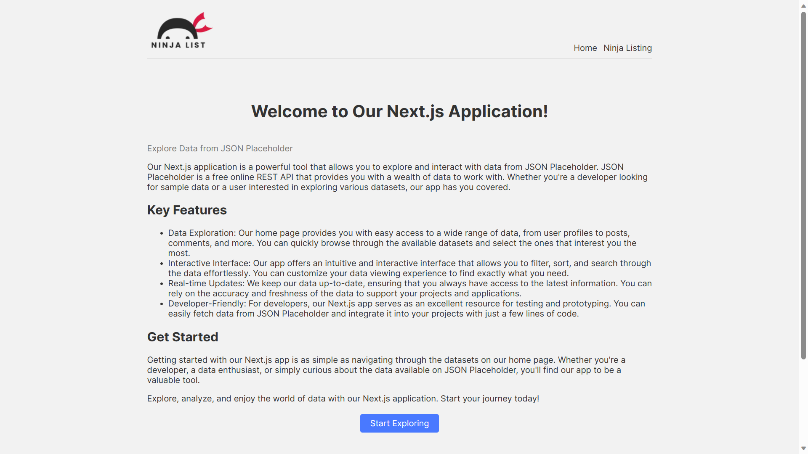
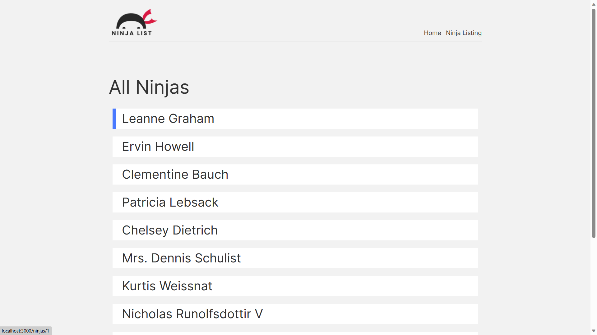
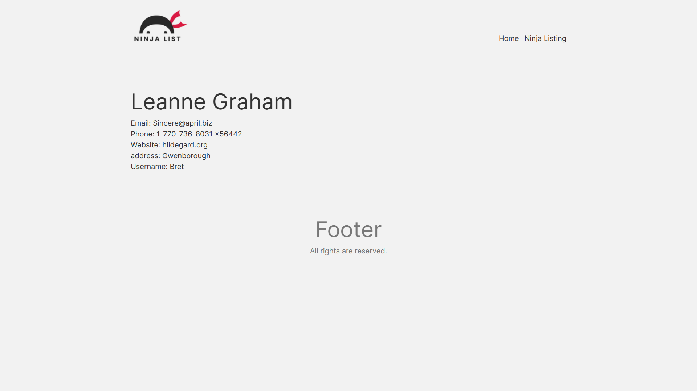

# Next.js JSON Placeholder Explorer

Our Next.js application is a powerful tool that allows you to explore and interact with data from JSON Placeholder. JSON Placeholder is a free online REST API that provides you with a wealth of data to work with. Whether you're a developer looking for sample data or a user interested in exploring various datasets, our app has you covered.

### Images

